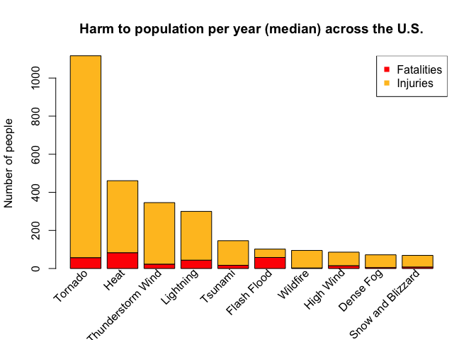
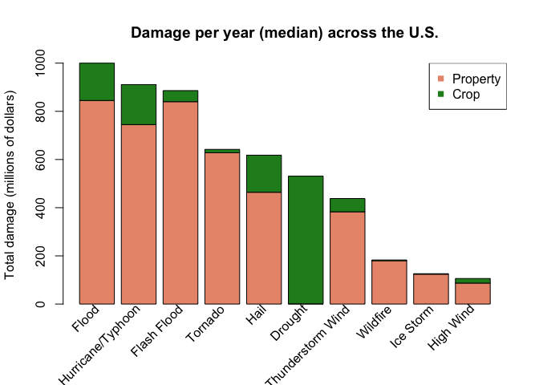

# Gone with the wind, flood, and heat.


## Synopsis

In this report we aim to explore the U.S. National Oceanic and Atmospheric Administration’s (NOAA) storm database. This database tracks characteristics of major storms and weather events in the United States, including when and where they occur, as well as estimates of any fatalities, injuries, and property damage. Data collection and processing procedures have been changing over time. To get more consistent results, this report operates with median values of harm to population and damages per year. Following table shows which types of events bring the most harmful consequences to population health and economic across the United States.

Pos | Most harmful to population health | Greatest economic consequences
----|-----------------------------------|-------------------------------
 1  | Tornado | Flood
 2  | Heat | Hurricane/Typhoon
 3  | Thunderstorm Wind | Flash Flood

## Data Processing

Let's start with loading of libraries needed to this project.


```r
library(dplyr)
library(reshape2)
```

#### Reading data


```r
setClass("myDate")
setAs("character", "myDate",
      function(from) as.Date(from, format="%m/%d/%Y %H:%M:%S"))
storm_classes <- c("BGN_DATE"="myDate")

src <- "repdata-data-StormData.csv"
src_tbl <- read.csv(src, header=TRUE, colClasses=storm_classes, stringsAsFactors=FALSE)
storm_tbl <- src_tbl %>%
    select(BGN_DATE, EVTYPE, FATALITIES, INJURIES, PROPDMG, PROPDMGEXP, CROPDMG, CROPDMGEXP)
names(storm_tbl) <- tolower(names(storm_tbl))
storm_tbl$bgn_date <- as.character(format(storm_tbl$bgn_date, "%Y"))
```

#### Reading EVTYPE filter from file


```r
evtype_filter<-read.csv("evtype_filter.csv", header=TRUE, stringsAsFactors=FALSE)
```

### 1. Analysis of consequences to population health


```r
fat_inj_tbl <- storm_tbl[storm_tbl$fatalities != 0 | storm_tbl$injuries != 0,]
fat_inj_tbl <- fat_inj_tbl %>% select(bgn_date, evtype, fatalities, injuries)
```

Clean up and convert EVTYPE to 48 storm event types specified by NOAA.


```r
fat_inj_tbl$not_fixed <- TRUE

for (i in 1:nrow(evtype_filter)) {
    idx<-grep(evtype_filter$pattern[i], fat_inj_tbl$evtype, ignore.case=TRUE)
    fix_vector <- fat_inj_tbl$not_fixed[idx]
    idx<-idx[fix_vector]
    if (length(idx) > 0) {
        fat_inj_tbl$evtype[idx] <- evtype_filter$substitute[i]
        fat_inj_tbl$not_fixed[idx] <- FALSE
    }
}
fat_inj_tbl$evtype<-as.factor(fat_inj_tbl$evtype)
fatalities_tbl <- fat_inj_tbl %>% select(-injuries, -not_fixed)
injuries_tbl <- fat_inj_tbl %>% select(-fatalities, -not_fixed)
```

Reshape fatalities and injuries tables to wide tidy form and summarize harm for each year. In result, we get tables with 61 rows which correspond to years from 1950 to 2011, and columns represent EVTYPEs. See fragment of reshaped fatalities table below.


```r
fatalities_tbl <- dcast(fatalities_tbl, bgn_date ~ evtype, value.var="fatalities", sum)
injuries_tbl <- dcast(injuries_tbl, bgn_date ~ evtype, value.var="injuries", sum)

print(fatalities_tbl[35:40, c(1, 28:31)], right=FALSE, row.names=FALSE)
```

```
##  bgn_date Storm Surge/Tide Strong Wind Thunderstorm Wind Tornado
##  1984     0                0           38                122    
##  1985     0                0           18                 94    
##  1986     0                0           36                 15    
##  1987     0                0           30                 59    
##  1988     0                0           23                 32    
##  1989     0                0           29                 50
```

The events in the database start from January 1950 and end in November 2011. Due to changes in the data collection and processing procedures over time, there are unique periods of record available depending on the event type. The following table shows the different time spans for each period of unique data collection and processing procedures.

Storm Events | Storm Events Database Period Of Record
-----------------------------------|-------------------------------
Tornado | 1950 - 2011
Tornado, Thunderstorm Wind, Hail | 1955 - 2011
All Event Types | 1996 - 2011

To equalize records that have been made during different time periods, we calculate median values of fatalities and injuries through periods of available records for each type of storm events. We use only non-zero values to calculate medians. It allows to estimate possible harm in a case if some of storm event happens.


```r
evtype <- names(fatalities_tbl)[2:ncol(fatalities_tbl)]
fatalities <- c()
injuries <- c()

for (name in evtype) {
    indexes <- fatalities_tbl[,name] > 0
    values  <- fatalities_tbl[indexes, name]
    fatalities <- c(fatalities, median(values))
}
for (name in evtype) {
    indexes <- injuries_tbl[,name] > 0
    values  <- injuries_tbl[indexes, name]
    injuries <- c(injuries, median(values))
}
fatalities <- ceiling(fatalities)
injuries   <- ceiling(injuries)
total_harm <- fatalities + injuries
harm_tbl   <- data.frame(evtype, fatalities, injuries, total_harm)

order_v  <- order(harm_tbl$total_harm, decreasing=TRUE)
harm_tbl <- harm_tbl[order_v,]
harm_tbl <- harm_tbl[1:10,]
row.names(harm_tbl) <- c(1:10)
harm_tbl$evtype <- as.factor(as.character(harm_tbl$evtype))
```

### 2. Analysis of consequences to economics


```r
damage_tbl <- storm_tbl[storm_tbl$propdmg != 0 | storm_tbl$cropdmg != 0,]
damage_tbl <- damage_tbl %>% select(-fatalities, -injuries)

damage_tbl$propdmgexp<-toupper(damage_tbl$propdmgexp)
damage_tbl$cropdmgexp<-toupper(damage_tbl$cropdmgexp)

damage_tbl$prop_mult <- 1.0
damage_tbl$prop_mult[damage_tbl$propdmgexp == "H"] <- 100.0
damage_tbl$prop_mult[damage_tbl$propdmgexp == "K"] <- 1000.0
damage_tbl$prop_mult[damage_tbl$propdmgexp == "M"] <- 1000000.0
damage_tbl$prop_mult[damage_tbl$propdmgexp == "B"] <- 1000000000.0

damage_tbl$propdmg <- damage_tbl$propdmg * damage_tbl$prop_mult

damage_tbl$crop_mult <- 1.0
damage_tbl$crop_mult[damage_tbl$cropdmgexp == "H"] <- 100.0
damage_tbl$crop_mult[damage_tbl$cropdmgexp == "K"] <- 1000.0
damage_tbl$crop_mult[damage_tbl$cropdmgexp == "M"] <- 1000000.0
damage_tbl$crop_mult[damage_tbl$cropdmgexp == "B"] <- 1000000000.0

damage_tbl$cropdmg <- damage_tbl$cropdmg * damage_tbl$crop_mult
damage_tbl <- damage_tbl %>% select(bgn_date, evtype, propdmg, cropdmg)
```

Clean up and convert EVTYPE to 48 storm event types specified by NOAA.


```r
damage_tbl$not_fixed <- TRUE

for (i in 1:nrow(evtype_filter)) {
    idx<-grep(evtype_filter$pattern[i], damage_tbl$evtype, ignore.case=TRUE)
    fix_vector <- damage_tbl$not_fixed[idx]
    idx<-idx[fix_vector]
    if (length(idx) > 0) {
        damage_tbl$evtype[idx] <- evtype_filter$substitute[i]
        damage_tbl$not_fixed[idx] <- FALSE
    }
}
damage_tbl$evtype<-as.factor(damage_tbl$evtype)
prop_dmg_tbl <- damage_tbl %>% select(-cropdmg, -not_fixed)
crop_dmg_tbl <- damage_tbl %>% select(-propdmg, -not_fixed)
```

Reshape fatalities and injuries tables to wide tidy form and summarize damage for each year. In result, we get tables with 61 rows which correspond to years from 1950 to 2011, and columns represent EVTYPEs. See fragment of reshaped property table below.


```r
prop_dmg_tbl <- dcast(prop_dmg_tbl, bgn_date ~ evtype, value.var="propdmg", sum)
crop_dmg_tbl <- dcast(crop_dmg_tbl, bgn_date ~ evtype, value.var="cropdmg", sum)

print(prop_dmg_tbl[45:50, c(1, 15:19)], right=FALSE, row.names=FALSE)
```

```
##  bgn_date Frost/Freeze Funnel Cloud Hail       Heat     Heavy Rain
##  1994        5000      10500         289822858     5000   68030250
##  1995           0          0         692280713 10877050 2560599000
##  1996     8000000          0         613136490        0   48103000
##  1997     1015000       2000         202142820    20500   11412500
##  1998           0      50000        1348376050        0   45313900
##  1999      200000       2000         442952140  3300000   30285000
```

To equalize records that have been made during different time periods, we calculate median values of property and crop damages through periods of available records for each type of storm events. We use only non-zero values to calculate medians. It allows to estimate possible damage in a case if some of storm event happens.


```r
evtype <- names(prop_dmg_tbl)[2:ncol(prop_dmg_tbl)]
property_damage <- c()
crop_damage <- c()

for (name in evtype) {
    indexes <- prop_dmg_tbl[,name] > 0
    values  <- prop_dmg_tbl[indexes, name]
    property_damage <- c(property_damage, median(values))
}
for (name in evtype) {
    indexes <- crop_dmg_tbl[,name] > 0
    values  <- crop_dmg_tbl[indexes, name]
    crop_damage <- c(crop_damage, median(values))
}
total_damage <- property_damage + crop_damage
dmg_tbl <- data.frame(evtype, property_damage, crop_damage, total_damage)

order_v <- order(dmg_tbl$total_damage, decreasing=TRUE)
dmg_tbl <- dmg_tbl[order_v,]
dmg_tbl <- dmg_tbl[1:10,]
row.names(dmg_tbl) <- c(1:10)
dmg_tbl$evtype <- as.factor(as.character(dmg_tbl$evtype))
```

## Results

### 1. Top 10 storm events which have largest consequences to population health


```r
oldpar <- par(mar = c(7, 4, 4, 2) + 0.1)
```


```r
plot_tbl <- rbind(harm_tbl$fatalities, harm_tbl$injuries)

harm_plot <- barplot(plot_tbl, col=c("red","goldenrod1"),
                     main="Harm to population per year (median) across the U.S.",
                     ylab="Number of people")
legend("topright", c("Fatalities","Injuries"),
       pch=15, col=c("red","goldenrod1"))
text(harm_plot, par("usr")[3]-0.25,
     labels=harm_tbl$evtype, srt=45, adj=1, xpd=TRUE)
```

 


```r
print(harm_tbl, right=FALSE)
```

```
##    evtype            fatalities injuries total_harm
## 1  Tornado           57         1060     1117      
## 2  Heat              83          378      461      
## 3  Thunderstorm Wind 23          323      346      
## 4  Lightning         44          256      300      
## 5  Tsunami           17          129      146      
## 6  Flash Flood       58           44      102      
## 7  Wildfire           3           92       95      
## 8  High Wind         15           71       86      
## 9  Dense Fog          5           67       72      
## 10 Snow and Blizzard  8           61       69
```

### 2. Top 10 storm events which have largest consequences to economics


```r
bar_1 <- ceiling(dmg_tbl$property_damage / 1000000.0)
bar_2 <- ceiling(dmg_tbl$crop_damage / 1000000.0)
plot_tbl <- rbind(bar_1, bar_2)

dmg_plot <- barplot(plot_tbl, col=c("darksalmon","forestgreen"),
                    main="Damage per year (median) across the U.S.",
                    ylab="Total damage (millions of dollars)")
legend("topright", c("Property","Crop"),
       pch=15, col=c("darksalmon","forestgreen"))
text(dmg_plot, par("usr")[3]-0.25,
     labels=dmg_tbl$evtype, srt=45, adj=1, xpd=TRUE)
```

 


```r
print(dmg_tbl, right=FALSE)
```

```
##    evtype            property_damage crop_damage total_damage
## 1  Flood             844435500       154872000   999307500   
## 2  Hurricane/Typhoon 744255010       165510000   909765010   
## 3  Flash Flood       839040900        45788700   884829600   
## 4  Tornado           627646440        13177960   640824400   
## 5  Hail              463019380       153844750   616864130   
## 6  Drought              825000       529317890   530142890   
## 7  Thunderstorm Wind 382000210        54693250   436693460   
## 8  Wildfire          179107000         2050000   181157000   
## 9  Ice Storm         123155000         1295000   124450000   
## 10 High Wind          86081120        18005100   104086220
```


```r
par(oldpar)
```

-----------------------------------------

#### This is EVTYPE filter which is stored in file "evtype_filter.csv"


```r
print(evtype_filter, right=FALSE)
```

```
##     pattern                      substitute         
## 1   [?]                          Other              
## 2   APACHE COUNTY                Other              
## 3   Marine Accident              Other              
## 4   MARINE MISHAP                Other              
## 5   DROWNING                     Other              
## 6   Other                        Other              
## 7   Avalan                       Avalanche          
## 8   Astronomical                 Astronomical Tide  
## 9   Tidal \\w                    Astronomical Tide  
## 10  Dust Devil                   Dust Devil         
## 11  DUST STORM                   Dust Storm         
## 12  BLOWING DUST                 Dust Storm         
## 13  FREEZING FOG                 Freezing Fog       
## 14  Freezing Spray               Freezing Fog       
## 15  DENSE FOG                    Dense Fog          
## 16  FOG                          Dense Fog          
## 17  DENSE SMOKE                  Dense Smoke        
## 18  DROUGHT                      Drought            
## 19  FUNNEL CLOUD                 Funnel Cloud       
## 20  SEICHE                       Seiche             
## 21  SLEET                        Sleet              
## 22  RIP CURRENT                  Rip Current        
## 23  MARINE \\w WIND              Marine Wind        
## 24  HEAT                         Heat               
## 25  UNSEASONABLY WARM            Heat               
## 26  WARM WEATHER                 Heat               
## 27  MUD[ ]?SLIDE                 Debris Flow        
## 28  LANDS                        Debris Flow        
## 29  ROCK SLIDE                   Debris Flow        
## 30  VOLCANIC ASH                 Volcanic Ash       
## 31  TSUNAMI                      Tsunami            
## 32  WINTER STORM                 Winter Storm       
## 33  WINTER WEATHER               Winter Weather     
## 34  WINTRY MIX                   Winter Weather     
## 35  WATERSPOUT                   Waterspout         
## 36  TORNADO                      Tornado            
## 37  TORNDAO                      Tornado            
## 38  TROPICAL DEPRESSION          Tropical Depression
## 39  TROPICAL STORM               Tropical Storm     
## 40  HURRICANE                    Hurricane/Typhoon  
## 41  TYPHOON                      Hurricane/Typhoon  
## 42  STORM SURGE                  Storm Surge/Tide   
## 43  HIGH TIDES                   Storm Surge/Tide   
## 44  LAKE.+SNOW                   Lake-Effect Snow   
## 45  LAKE.+FLOOD                  Lakeshore Flood    
## 46  FROST                        Frost/Freeze       
## 47  FREEZE                       Frost/Freeze       
## 48  HEAVY SURF                   High Surf          
## 49  HIGH SURF ADVISORY           High Surf          
## 50  ^\\s?HIGH SURF               High Surf          
## 51  ROUGH SURF                   High Surf          
## 52  HEAVY SWELLS                 High Surf          
## 53  HIGH SEAS                    High Surf          
## 54  HIGH SWELLS                  High Surf          
## 55  HIGH WAVES                   High Surf          
## 56  HEAVY SEAS                   High Surf          
## 57  ROUGH SEAS                   High Surf          
## 58  ROGUE WAVE                   High Surf          
## 59  HAZARDOUS SURF               High Surf          
## 60  HEAVY RAIN/LIGHTNING         Heavy Rain         
## 61  TSTM WIND.+LIGHTNING         Thunderstorm Wind  
## 62  THUNDERSTORM WIND.+LIGHTNING Thunderstorm Wind  
## 63  LIGHTNING                    Lightning          
## 64  LIGNTNING                    Lightning          
## 65  LIGHTING                     Lightning          
## 66  FIRE                         Wildfire           
## 67  FLOOD.+HEAVY RAIN            Flood              
## 68  HIGH WIND.+HEAVY RAIN        High Wind          
## 69  HEAVY.+FLOOD                 Heavy Rain         
## 70  RAINSTORM                    Heavy Rain         
## 71  RECORD RAINFALL              Heavy Rain         
## 72  HVY RAIN                     Heavy Rain         
## 73  UNSEASONAL RAIN              Heavy Rain         
## 74  EXCESSIVE WETNESS            Heavy Rain         
## 75  HEAVY SHOWER                 Heavy Rain         
## 76  HEAVY MIX                    Heavy Rain         
## 77  HEAVY PRECIPITATION          Heavy Rain         
## 78  FLASH FLOOD                  Flash Flood        
## 79  FLOOD[ /]FLASH               Flash Flood        
## 80  DAM BREAK                    Flash Flood        
## 81  BREAKUP FLOODING             Flash Flood        
## 82  RAPIDLY RISING WATER         Flash Flood        
## 83  HIGH WINDS/SNOW              High Wind          
## 84  ICE AND SNOW                 Ice Storm          
## 85  ^FREEZING RAIN               Cold and Chill     
## 86  LIGHT FREEZING RAIN          Cold and Chill     
## 87  SNOWMELT FLOODING            Flood              
## 88  HEAVY SNOW                   Snow and Blizzard  
## 89  SNOW                         Snow and Blizzard  
## 90  MIXED PRECIPITATION          Snow and Blizzard  
## 91  MIXED PRECIP                 Snow and Blizzard  
## 92  BLIZZARD                     Snow and Blizzard  
## 93  HIGH[ ]+WIND                 High Wind          
## 94  FREEZING DRIZZLE             Cold and Chill     
## 95  COLD                         Cold and Chill     
## 96  COOL AND WET                 Cold and Chill     
## 97  EXTREME WINDCHILL            Cold and Chill     
## 98  EXTREME WIND CHILL           Cold and Chill     
## 99  LOW TEMPERATURE              Cold and Chill     
## 100 HYPERTHERMIA/EXPOSURE        Cold and Chill     
## 101 TSTM WIND/HAIL               Thunderstorm Wind  
## 102 THUNDERSTORM.+HAIL           Thunderstorm Wind  
## 103 WIND/HAIL                    Strong Wind        
## 104 HAIL                         Hail               
## 105 COASTAL                      Coastal Flood      
## 106 Erosion/Cstl Flood           Coastal Flood      
## 107 Beach Erosion                Coastal Flood      
## 108 ICE                          Ice Storm          
## 109 ICY ROADS                    Ice Storm          
## 110 GLAZE                        Ice Storm          
## 111 THUNDERSTORM WIND.+FLOOD     Thunderstorm Wind  
## 112 FLOOD                        Flood              
## 113 HIGH WATER                   Flood              
## 114 URBAN                        Flood              
## 115 NON-TSTM WIND                Strong Wind        
## 116 NON-SEVERE WIND DAMAGE       Strong Wind        
## 117 TSTM WIND                    Thunderstorm Wind  
## 118 TSTMW                        Thunderstorm Wind  
## 119 BURST                        Thunderstorm Wind  
## 120 THUNDERSTORM                 Thunderstorm Wind  
## 121 THUDERSTORM                  Thunderstorm Wind  
## 122 THUNDEERSTORM                Thunderstorm Wind  
## 123 THUNDERESTORM                Thunderstorm Wind  
## 124 THUNDERSTROM                 Thunderstorm Wind  
## 125 THUNDERTORM                  Thunderstorm Wind  
## 126 THUNERSTORM                  Thunderstorm Wind  
## 127 TUNDERSTORM                  Thunderstorm Wind  
## 128 SEVERE TURBULENCE            Thunderstorm Wind  
## 129 GUSTNADO                     Thunderstorm Wind  
## 130 WHIRLWIND                    Thunderstorm Wind  
## 131 STORM FORCE WINDS            Thunderstorm Wind  
## 132 WIND                         Strong Wind        
## 133 RAIN                         Heavy Rain         
## 134 HIGH                         Other
```
